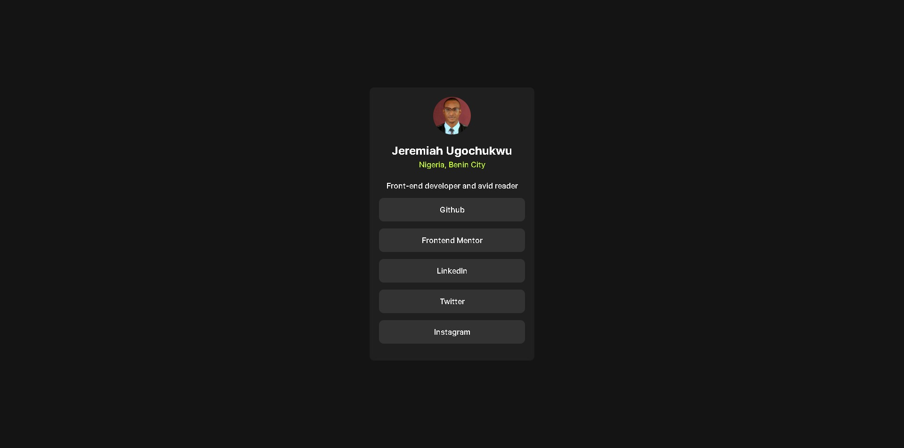

# Frontend Mentor - Social links profile solution

This is a solution to the [Social links profile challenge on Frontend Mentor](https://www.frontendmentor.io/challenges/social-links-profile-UG32l9m6dQ). Frontend Mentor challenges help you improve your coding skills by building realistic projects. 

## Table of contents

- [Overview](#overview)
  - [The challenge](#the-challenge)
  - [Screenshot](#screenshot)
  - [Links](#links)
- [My process](#my-process)
  - [Built with](#built-with)
  - [What I learned](#what-i-learned)
  - [Useful resources](#useful-resources)
- [Author](#author)
- [Acknowledgments](#acknowledgments)

## Overview

### The challenge

Users should be able to:

- See hover and focus states for all interactive elements on the page

### Screenshot

### Links

- Live Site URL: [Live url](https://jeremiah-ugochukwu.netlify.app/)

## My process

### Built with

- CSS custom properties
- [React](https://reactjs.org/) - JS library
- [vite] (https://vitejs.dev/) - Vite library

### What I learned

Creating a component and the use of States in react

## Author

- Website - [Jeremiah Ugochukwu](https://jeremiah-ugochukwu.netlify.app/)
- Frontend Mentor - [@Jerryhugo](https://www.frontendmentor.io/profile/Jerryhugo)
- Twitter - [@Jeremiah Ugochukwu](https://x.com/JeremiahOk23310)

## Acknowledgments

I want to thank frontend mentor for creating these challenges in other to foster the learning of frontend development

